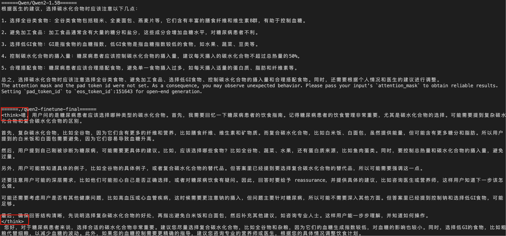

# 微调 Qwen/Qwen2-1.5B

```python
pip install -r requirements.txt 
python download.py  #下载数据集并转alpaca格式
python train.py     #训练模型
python generate.py  #对比base模型和微调后到模型输出（如下图，可以看到模型具有思考能力了）
```




微调具体的参数设置需要根据显卡修改，本微调脚本（train.py）采用混合精度训练，使用adamw优化器，batchsize=1，seqlen=2048，不开gradient_checkpointing。显存占用50多GB（在单张H20下可正确运行）


模型已上传至huggingface和modelscope，可以通过如下代码直接使用
```python
import torch
from transformers import AutoModelForCausalLM, AutoTokenizer
 
device = "cuda:0"
tokenizer = AutoTokenizer.from_pretrained("zhuangxing/Qwen2-think-1.5B")
model = AutoModelForCausalLM.from_pretrained("zhuangxing/Qwen2-think-1.5B")
model.to(device)


test_texts = {
    'instruction': "你是一个医学专家，你需要根据用户的问题，给出带有思考的回答。",
    'input': "医生，我最近被诊断为糖尿病，听说碳水化合物的选择很重要，我应该选择什么样的碳水化合物呢？"
}
instruction = test_texts['instruction']
input_value = test_texts['input']

messages = [
    {"role": "system", "content": f"{instruction}"},
    {"role": "user", "content": f"{input_value}"}
]

 
text = tokenizer.apply_chat_template(messages, tokenize=False, add_generation_prompt=True)
model_inputs = tokenizer([text], return_tensors="pt").to(device)

generated_ids = model.generate(model_inputs.input_ids, max_new_tokens=2048)
generated_ids = [output_ids[len(input_ids):] for input_ids, output_ids in zip(model_inputs.input_ids, generated_ids)]
response = tokenizer.batch_decode(generated_ids, skip_special_tokens=True)[0]

print(response)
```